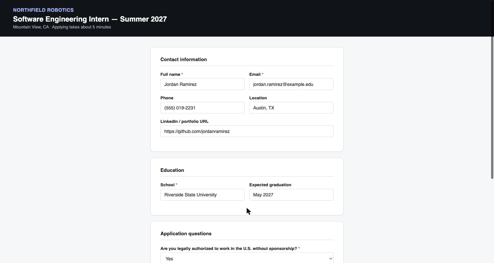
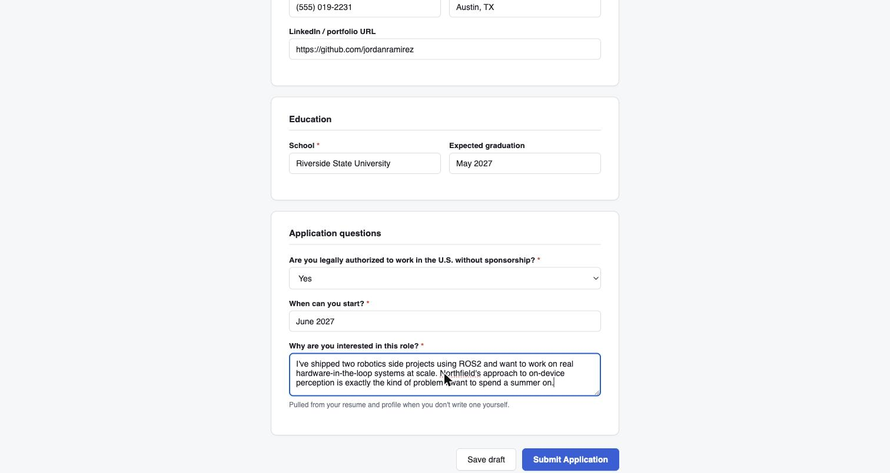

# jev-applybot

**Fill out one internship application from your resume, then stop.**

You give it a job posting URL and a profile (resume + answers to the usual questions). It walks the form field by field — name, school, work authorization, "why this role" — and stops at the review screen. It never clicks Submit / Apply / Send Application on its own. You read the filled form and press that button yourself.



*A sample application form (not a real job posting) filled with placeholder data, to show the shape of what the tool does. Candidate name and details above are made up for this screenshot — nothing here is a real person.*

## Why it stops before submitting

Two separate reasons, both non-negotiable:

1. **Most job boards' terms of service prohibit automated applications** — Workday, Greenhouse, LinkedIn Easy Apply, and Handshake all restrict bot-submitted applications in some form. Filling a form you then review and submit yourself is a different thing than a bot submitting on your behalf, and this tool is built for the former.
2. **A submitted application isn't reversible the way a filled-in field is.** Every other action in this loop can be corrected on the next pass. Submit can't be undone.

The guard is a plain regex check in code (`SUBMIT_PATTERN` in [`internship_apply/apply.py`](internship_apply/apply.py)) that runs *after* the model has decided what to click and *before* the browser executes it. It doesn't depend on the model choosing to behave — it can't click a matched button, full stop, unless you explicitly pass `--confirm-submit` after reviewing the form yourself.

## How it decides what to do

Every observed page becomes an indexed table of clickable, fillable, and selectable elements. [TypeSafe's Jev](https://docs.typesafe.ai/introduction) is asked which operation to perform and which element to target — one API call, evaluated in parallel, not a chain of reasoning steps. A small text model only gets involved when a field needs typed text, and even then, it's told never to invent a fact that isn't in your resume or profile — if nothing covers a field, it's left blank and reported back to you.

```text
one job page → indexed elements → Jev picks operation + target → browser acts → observe again
                                          │
                          CLICK a Submit-like button? → blocked unless --confirm-submit
```

This decision loop, the DOM reader, and the browser connection are [jev-ultrafast](https://github.com/browser-use/jev-ultrafast), vendored in under `jev_ultrafast/` — see **Credits** below. `internship_apply/` is the layer built on top of it for this one job: load a profile, build a goal, guard the submit click, report what got skipped.

## Setup

```bash
git clone https://github.com/JeremyEltho/jev-applybot.git
cd jev-applybot
uv sync
cp .env.example .env
# add TYPESAFE_API_KEY and TEXT_MODEL_API_KEY to .env
cp internship_apply/profile.example.json internship_apply/profile.json
# edit profile.json with your real info, and add internship_apply/resume.txt next to it
```

`profile.json` and `resume.txt` are gitignored — your real details never get committed by accident.

## Run

```bash
uv run --env-file .env python -m internship_apply.apply \
  --url "https://jobs.example.com/postings/1234" \
  --profile internship_apply/profile.json
```

It prints each field as it fills it:

```text
   210 ms  fill    Full name
   340 ms  fill    Email
   480 ms  select  Are you legally authorized to work in the U.S. without sponsorship?
   610 ms  fill    Why are you interested in this role?

Stopped before clicking a submit control: "Submit Application"
Review the filled form in the browser, then either:
  - click it yourself, or
  - re-run this command with --confirm-submit once you've checked it.
```



If a field couldn't be filled from your resume or profile, it's listed at the end so you can finish it by hand before you submit.

```bash
# once you've reviewed the form yourself:
uv run --env-file .env python -m internship_apply.apply \
  --url "https://jobs.example.com/postings/1234" \
  --profile internship_apply/profile.json \
  --confirm-submit
```

Full usage, the profile schema, and more on the ToS question: [`internship_apply/README.md`](internship_apply/README.md).

## What it's not

- **Not a job search tool.** You give it one posting URL at a time; it doesn't browse boards or discover postings for you.
- **Not a mass-applier.** Running it against many postings in a loop is exactly the use its own submit guard and the ToS note above are trying to keep you out of.
- **Not a resume writer.** It reads your resume; it doesn't improve it.

## Credits

The browser agent — the operation/target decision loop, the DOM snapshot reader, and the Chrome connection — is [browser-use/jev-ultrafast](https://github.com/browser-use/jev-ultrafast), used here under its MIT license (see [LICENSE](LICENSE)). All of the underlying "why it's fast" engineering — one TypeSafe request per decision, atomic DOM reads, freshness checks before every click — is their work, not this repo's. `internship_apply/` is what's new here: the profile/resume loading, the goal construction, the submit guard, and the CLI around it.

Decision model: [TypeSafe's Jev](https://docs.typesafe.ai/introduction).
