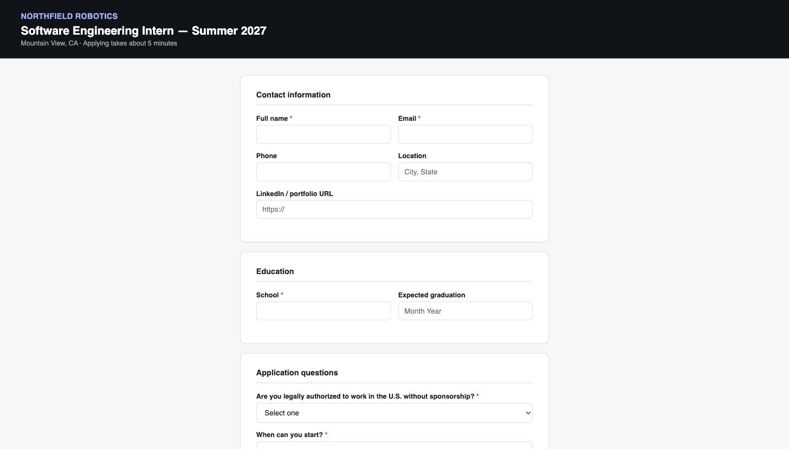

# Internship application filler

Fills one job application form from your resume and a Q&A profile, using the same
Jev-driven click/type/select loop as the rest of this repo. It stops before the final
submit control and leaves the browser tab open — you review and press it yourself, or
re-run with `--confirm-submit` once you trust it on a given site.



## Setup

1. From the repo root: `uv sync`, then `cp .env.example .env` and fill in
   `TYPESAFE_API_KEY` and `TEXT_MODEL_API_KEY` (see the main README).
2. Copy `internship_apply/profile.example.json` to `internship_apply/profile.json`
   and fill in your real details. Both `profile.json` and your resume files are
   gitignored.
3. Put your resume as plain text next to it (`internship_apply/resume.txt`) — this is
   what the model reads. If you only have a PDF or DOCX, convert it
   (`pdftotext resume.pdf resume.txt`) or paste the text into a `.txt` file.
4. Optionally set `resume_file` to your resume PDF. When a page has a file-upload box
   (Workday's "Autofill with Resume", Greenhouse's attach field), the file is attached
   to it directly — no model involved.

## Run

```
uv run --env-file .env python -m internship_apply.apply \
  --url "https://acme.wd5.myworkdayjobs.com/en-US/Careers/job/Software-Intern_R123" \
  --profile internship_apply/profile.json
```

It prints each field as it fills it and, on Workday, which step of the wizard it is on:

```text
== Workday: My Information ==
   210 ms  fill    First Name
   ...
== Workday: My Experience ==
   attached resume to file input "file-upload-input-ref"
   ...
== Workday: Review ==

Stopped before clicking a submit control: "Submit"
The browser tab is still open. Review the filled form there, then either:
  - click that button yourself, or
  - re-run this command with --confirm-submit once you've checked it.
```

Any field it could not fill from your resume or profile is listed at the end so you can
finish those by hand before you submit.

### Flags

| Flag | What it does |
| --- | --- |
| `--confirm-submit` | Allow clicking the final Submit control. Only after you've reviewed a run on that site. |
| `--block-label TEXT` | Treat another button label as final submission (repeatable), for sites not in `sites.py`. |
| `--pause-below P` | Pause and show the model's options whenever its confidence is below `P` (try `0.6` on a new site). |
| `--max-steps N` | Action budget, default 200. A full Workday application is roughly 60–120 actions. |
| `--record-dir DIR` | Save a screenshot per step. |
| `--trace FILE` | Write a JSON trace: every decision, filled value, upload, pause, and the final page. Useful when something went wrong. |
| `--close` | Close the browser tab when the run stops (default: leave it open for review). |
| `--no-input` | Never prompt. A sign-in wall or a low-confidence pause stops the run instead. |

## Sign-in walls

Workday (and some others) require an account before you can apply. The engine never
shows password fields to the model, so when a sign-in form is on screen the run pauses:

```text
A sign-in form is showing at https://acme.wd5.myworkdayjobs.com/...
Switch to the Chrome tab titled "Careers", sign in or create your account there,
then press Enter here to continue...
```

Sign in yourself in that tab, come back, press Enter. Your password is never read,
stored, or typed by this tool.

## Profile fields

`profile.example.json` shows every field. The ones that matter most per site:

- `first_name`, `last_name`, `address`, `phone_type` — Workday asks for these separately.
- `education[]` and `experience[]` — structured entries for Workday's per-field
  education and work-history sections (`start`/`end` as `MM/YYYY`).
- `answers` — free-form answers to common screening questions; add your own keys.
- `disclosures` — voluntary EEO questions (gender, race/ethnicity, veteran, disability).
  Leave a value blank and the agent picks the "decline to answer" option for it.
- `resume_file` — a PDF to attach where a page has an upload box.

## Supported sites

`sites.py` carries navigation notes per ATS. Anything else gets generic handling.

| Site | What the notes cover |
| --- | --- |
| Workday (`myworkdayjobs.com`) | The six-step wizard, Save and Continue vs Submit, button-style dropdowns, split month/year dates, the Apply → Autofill/Manually choice. |
| Greenhouse | Single page; needs the direct `boards.greenhouse.io` URL, not an iframe embed. |
| Lever, Ashby | Single page ending in Submit application. |
| LinkedIn Easy Apply | The multi-page modal; Next/Review vs Submit application. |

## What it will not do

- It never clicks Submit / Send Application / Finish Application on its own. That match
  is an anchored label pattern in `sites.py`, checked in code after the model has chosen
  and before the browser acts — so it holds even if a page or prompt tries to talk it
  out of it. "Apply", "Apply Now", and "Apply Manually" are deliberately *not* matched:
  those open a form, they don't send it.
- It never types a password or creates an account. It pauses and you do that.
- It never invents personal information. If a field isn't covered by your resume or
  profile, it's left blank and reported to you at the end.
- It does not search job boards or discover postings — you give it one URL at a time.

## Before you point this at a real job board

Read that board's terms of service. Many (Workday, Greenhouse, LinkedIn Easy Apply,
Handshake) explicitly prohibit automated or bot-submitted applications, separate from
whether this tool stops before the submit click. Using it to *fill* a form you'll
review and submit yourself is the safer reading; having it click submit at scale
across many postings is the kind of use those terms are written to catch.
